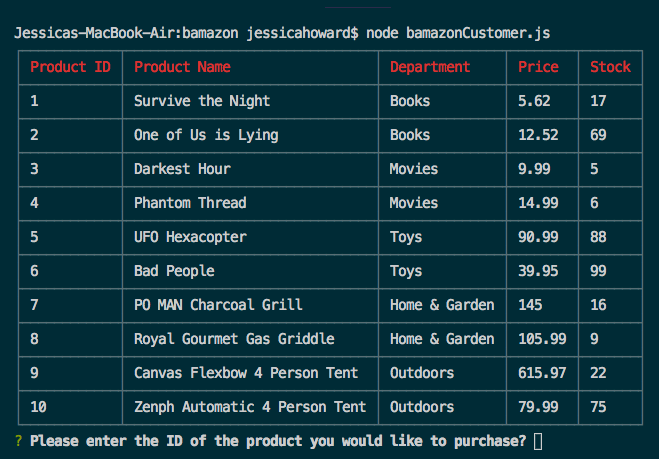
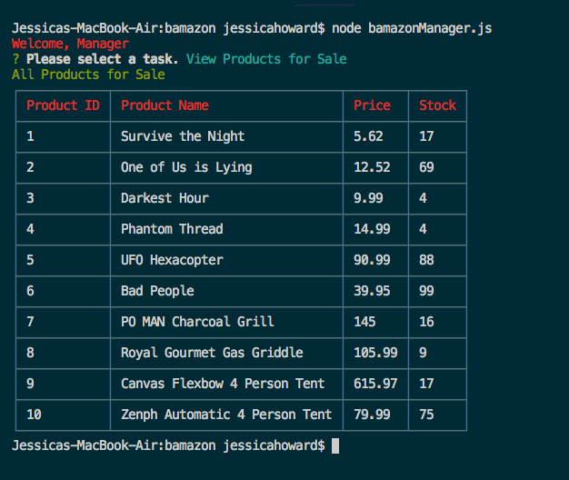

# bamazon

# Command Line Storefront

### Overview

An Amazon-like storefront that takes in orders from customers and depletes stock from the store's inventory.
Store Manager can review product sales, replenish stock and add new items to the store.

[Video Demonstration](https://drive.google.com/file/d/1My4wB782MJy96zuGrZxLUqBwVprYzcIo/view)

### Instructions

* Please install node_modules from package.json to run locally.

### Commands and functions of Liri bot

  1. `node bamazonCustomer.js`

    * Prompts Customer for purchase info.

  2. `node bamazonManager.js`

    * Promts Manager for tasks.

        * View Sales Data

        * View Low Inventory

        * Add to Existing Stock

        * Add New Product to Inventory
    
   # Built with 
    
    * node.js
    * JavaScript
    * MySQL